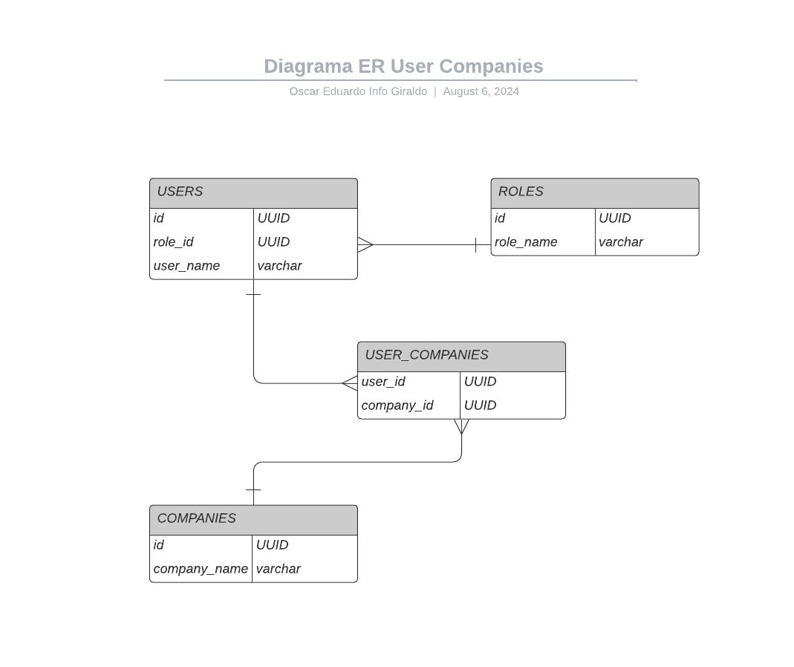

# User companies
## Base de Datos Relacional con PostgreSQL para Gestión de Usuarios, Roles y Compañías
Este proyecto implementa una base de datos relacional en PostgreSQL que maneja la gestión de usuarios, roles y compañías. La base de datos permite asignar múltiples compañías a un usuario, pero un usuario solo puede tener un único rol. Además, las compañías asignadas a un usuario no se pueden compartir entre usuarios.

## Modelo Entidad-Relación

### Tablas y Relaciones
#### ROLES
- id: UUID, Primary Key
- role_name: VARCHAR(50), Not Null

#### USERS
- id: UUID, Primary Key 
- user_name: VARCHAR(50), Not Null
- role_id: UUID, Foreign Key (refiere a roles.id)

#### COMPANIES
- id: UUID, Primary Key
- company_name: VARCHAR(100), Not Null

#### USER_COMPANIES
- user_id: UUID, Foreign Key (refiere a users.id), Primary Key
- company_id: UUID, Foreign Key (refiere a companies.id), Primary Key, Unique

### Requisitos
* PostgreSQL 9.4 o superior
* Extensión UUID en PostgreSQL

### Ejecución
- 1 acceder a la ruta ./src/scripts
- 2 crear la DB: pslq user_companies
- 3 ejecutar cada uno de los scripts en el siguiente orden:
 
 [1] psql user_companies -f 1_create_tables.sql

 [2] psql user_companies -f 2_insert_data.sql

 [3] psql user_companies -f 3_assign_companies.sql

 [4] psql user_companies -f 4_queries.sql

### AUTOR
OSCAR EDUARDO INFO GIRALDO

### Licencia
Este proyecto está licenciado bajo la MIT License.
